# Tracking `/ship-phase` — design vision

**Status:** proposal. Nothing described here is built yet.
**Scope:** how to make a `/ship-phase` run observable while it runs, and what to render from it — the
problem, the event model, and the panels. The contracts that implement it (event schema, log format,
concurrency, redaction, tests) are in **[architecture.md](architecture.md)**.

---

## 1. The problem

`/ship-phase` is a long, deeply nested, mostly-silent process. A single `/ship-phase v01` run walks
four versions, each through six steps, each step through 3–7 issues, each issue through
implement → validate → commit → push → close. That is on the order of a hundred meaningful state
transitions — and today **exactly one of them reaches the user**: the per-phase chat report, emitted
after everything has already happened.

The sibling orchestrator is no better. `/ship-solution` stamps `date +%s` per version and writes a
single report at the end. Both hold their statistics **in memory** until the run finishes.

Three consequences:

- **No live signal.** A 40-minute run is indistinguishable from a hung one.
- **A crash loses everything.** In-memory statistics die with the run. `ship-solution`'s own
  instructions half-acknowledge this — "persist rows as you go so a long run never loses a
  measurement" — but nothing else does.
- **Failures leave no trace at all.** This is the sharpest gap. When an issue fails validation,
  `execute-issues` Step 3 reverts with `git checkout -- .` and moves on. The attempt is erased: no
  commit, no file, no record. **The single most valuable signal in the whole pipeline — what the model
  got wrong on the first try — is the one thing currently guaranteed to be unrecoverable.**

That last point decides the architecture. Any approach that reconstructs history after the fact (from
git, from the reports) is structurally blind to failed attempts. **Tracking has to be emitted in
flight.**

---

## 2. What a run actually is

A `ship-phase` run is a strict tree. Every node has a start, an end, a status, and a payload.

```mermaid
graph TD
    R["run · ship-phase v01"] --> P["phase · v01"]
    P --> V["version · v01.01"]
    V --> S1["step · generate-issues"]
    V --> S2["step · upload-issues"]
    V --> S3["step · execute-issues"]
    V --> S4["step · review-and-fix"]
    V --> S5["step · release-version"]
    S3 --> I1["issue · ARENA-001"]
    S3 --> I2["issue · ARENA-002"]
    I1 --> A1["implement"]
    I1 --> A2["validate · pytest + mypy"]
    I1 --> A3["commit + push + close"]
    S4 --> F1["finding · #1 HIGH"]
    P --> H["harden · phase boundary"]
```



The tree is the schema. Everything the dashboard wants to show — progress, throughput, where time
goes, what failed — is a query over this tree plus timestamps.

---

## 3. Design principles

1. **Append-only, on disk, immediately.** Every event is one line appended to a JSONL file the moment
   it happens. Crash-safe, tailable, trivially parsed, no database.
2. **Emission must never gate the pipeline.** A failed write, a full disk, an absent dashboard — none
   of it may fail a step or change what gets built. Tracking observes; it never participates.
3. **Record attempts, not just outcomes.** Failed validations, reverts, retries and held findings are
   first-class events. They are the point.
4. **Derive nothing that can be observed.** Prefer an explicit event over inferring from git later.
5. **The dashboard is a renderer.** It holds no authority and no state of its own — exactly the
   Player/Observer split the tracked application itself uses. Delete it and the run is unaffected.
6. **Everything tracking-related lives under `codegen/`.** Source, servers, scripts, event logs,
   snapshots, caches, PID files, dashboard build output — all of it, with exactly one documented
   exception (§4.1). Nothing tracking-related is written to the repo root, to `spec/`, or anywhere in
   the generated application tree. `rm -rf codegen/` must remove the entire tracking system and leave a
   working repo behind. This is not tidiness: the application tree is **deleted and regenerated** every
   run, so anything of ours living there would be destroyed by the very process it exists to observe.

---

## 4. Layout and the event log — everything under `codegen/`

```
codegen/
  ship-phase-tracking-vision.md   this document
                                  ── committed source ──────────────────────────
  tracker/
    schema.json                   the event contract
    emit.py                       append one event; the only writer
  hooks/
    on_tool_use.py                hook scripts (registered from .claude/, see §4.1)
    on_stop.py
  dashboard/
    server.py                     FastAPI: tails events.jsonl, pushes over WS
    static/                       index.html · app.js · styles.css (no build step)
      vendor/                     any third-party asset — NOT lib/ or dist/, see below
                                  ── runtime, gitignored ───────────────────────
  runs/
    <run-id>/
      events.jsonl                append-only, the source of truth
      state.json                  derived snapshot, rewritten per event
    current                       pointer to the active run, for sub-skills
  var/
    dashboard.log · dashboard.pid · any cache or scratch
```

Committed: `tracker/`, `hooks/`, `dashboard/`, this document. Gitignored: `codegen/runs/` and
`codegen/var/` — runs are data, not source. A run worth keeping is promoted deliberately.

**Nothing goes outside this tree.** No log at the repo root, no PID file in `/tmp`, no SQLite beside
`arena.db`, no scratch in `spec/`. If the dashboard needs to write something, it writes it under
`codegen/var/`. The rule has teeth here specifically because the application tree is wiped and rebuilt
each run — a tracker that stored anything in `server/` or `tests/` would be deleted by the process it
is watching.

> **Pre-existing violation to fix while instrumenting:** `/ship-solution` currently persists its
> running statistics to **`.ship-solution-progress.md` in the repo root**. That is tracking data living
> outside `codegen/`. Move it to `codegen/var/` (or fold it into the event log, which supersedes it
> entirely) when step 2 of the build order lands.

**Naming trap — avoid `lib/`, `build/`, `dist/`, `target/`, `parts/` anywhere under `codegen/`.** The
repo's `.gitignore` is GitHub's Python template, whose directory patterns are **unanchored** and so
match at any depth. `codegen/dashboard/static/lib/vendor.js` is silently ignored by the `lib/` rule on
line 17; `.../build/` by line 11. Verified with `git check-ignore`. Because a re-include cannot rescue a
file whose *parent directory* is excluded, the fix is to not use those names: **`vendor/`, `assets/`,
`js/`, `css/` are all clear**. There should be no `build/` in any case — the dashboard has no build step.
Before adding any new directory under `codegen/`, run `git check-ignore -v <path>` and confirm it
returns nothing.

### 4.1 The one exception: hook registration

Hooks must be declared in **`.claude/settings.json`** — the harness reads that path and no other, so
the registration cannot live under `codegen/`. Keep the footprint minimal: `settings.json` holds only
the matcher and a command that invokes a script **in `codegen/hooks/`**. All hook logic, and every byte
of hook output, stays inside `codegen/`.

That is the complete list of tracking-related files outside `codegen/`: a few lines of JSON pointing
inward.

### Event shape

```json
{
  "ts": "2026-08-03T14:22:31.482Z",
  "run_id": "run-20260803-142012",
  "type": "issue.validate.end",
  "scope": { "phase": "v01", "version": "v01.01", "step": "execute-issues", "issue": "ARENA-003" },
  "status": "fail",
  "data": {
    "pytest": { "passed": 41, "failed": 1, "duration_s": 6.1 },
    "mypy": { "errors": 0 },
    "attempt": 1
  }
}
```

`scope` is the path through the tree, so any event can be attributed without parsing what came
before. `status` is one of `ok` / `fail` / `skip` / `held`.

Ordering is **file line order**, assigned as `seq` by the reducer on read — emitters are independent
processes with no shared counter, so no writer can know its own sequence number. Full envelope,
per-type `data` requirements, and the append/concurrency contract are in
**[architecture.md](architecture.md) §2 and §4**.

### Event types

| Group | Types |
|---|---|
| Run | `run.start` · `run.resumed` · `run.end` · `run.aborted` |
| Phase | `phase.start` · `phase.end` |
| Version | `version.start` · `version.decomposed` · `version.end` · `version.skipped` |
| Estimate | `run.estimate` — once, before anything is decomposed |
| Step | `step.start` · `step.end` · `gate.blocked` |
| Issue | `issue.start` · `issue.uploaded` · `issue.implement.end` · `issue.validate.end` · `issue.commit` · `issue.closed` · `issue.failed` · `issue.reverted` · `issue.end` |
| Review | `finding.raised` · `finding.classified` · `finding.fixed` · `finding.deferred` |
| Harden | `harden.start` · `harden.skipped` (`--no-harden`) · `harden.finding.fixed` · `harden.finding.held` |
| Tool | `tool.used` — emitted by hooks, the deterministic floor |
| Release | `release.tagged` · `release.pushed` |

`gate.blocked` deserves emphasis: `ship-phase`'s gates are its whole contribution as an orchestrator,
and a blocked gate is the clearest possible explanation of why a run stopped.

`version.decomposed` deserves the same: it is the instant total scope changes, and everything that
shows progress depends on distinguishing before from after it. `issue.uploaded` / `issue.closed` carry
the GitHub issue numbers, which is what makes created/closed/open countable at all.

---

## 5. Where the events come from

Three sources, each covering the others' blind spots.

### a. Skill-emitted — the semantics

The sub-skills gain an emit instruction at the points that already exist as discrete steps. These are
the only source that knows *meaning* — that this Bash call was "validating ARENA-003, attempt 2".

| Skill | Existing step | Event |
|---|---|---|
| `ship-phase` | Step 0 baseline | `run.start` (+ baseline test count) |
| `ship-phase` | Step 1 per version | `version.start` / `version.end` |
| `ship-phase` | Step 1 gates | `gate.blocked` |
| `execute-issues` | 2a announce | `issue.start` |
| `execute-issues` | 2d validate | `issue.validate.end` |
| `execute-issues` | 2e commit | `issue.commit` |
| `execute-issues` | Step 3 failure | `issue.failed` + `issue.reverted` ← **the erased path** |
| `review-and-fix-issues` | Step 2 doc | `finding.raised` / `finding.classified` |
| `review-and-fix-issues` | Step 4 update | `finding.fixed` |
| `harden-findings` | Step 1 loop | `harden.finding.fixed` / `.held` |
| `release-version` | Steps 5–6 | `release.tagged` / `release.pushed` |

**Weakness:** compliance is soft. A model following a long skill file may skip an emit under pressure,
and the gap is silent.

### b. Hooks — the deterministic spine

`PreToolUse` / `PostToolUse` / `Stop` hooks are executed by the harness, not the model. They **cannot
be forgotten**. They see every Bash command, every file write, every `gh` call, with real timestamps.
Registered in `.claude/settings.json` (the one permitted exception, §4.1), but every script and every
byte they write lives in `codegen/hooks/` and `codegen/runs/`.

They cover exactly what (a) is weak at — guaranteed timing and guaranteed occurrence — and are blind
to exactly what (a) is good at: they see `pytest -q` run, not that it was ARENA-003's second attempt.

**Use hooks as the clock and the floor.** If a skill forgets `issue.validate.end`, the hook still
recorded that pytest ran, when, and with what exit code. Reconciliation can flag the discrepancy —
which is itself a useful measurement of skill compliance.

### c. Git — the ground truth

One issue = one commit is already enforced. After a run, `git log` independently confirms what landed.
Useful for reconciling the log against reality, and for catching the case where the log claims a commit
that does not exist. **Never sufficient alone** — reverted attempts are invisible to it.

> **The composition:** hooks give a spine that cannot be forgotten, skills give it meaning, git proves
> it afterwards. No single source is trusted for everything.

---

## 6. The dashboard

A small FastAPI process living in **`codegen/dashboard/`** that tails `codegen/runs/<run-id>/
events.jsonl` and pushes each new event over a WebSocket to a vanilla HTML/CSS/JS page — no build step.
It writes only to `codegen/var/` (log, PID) and reads only from `codegen/runs/`.

This deliberately mirrors the architecture of the application being generated: an authoritative server
pushing events to a stateless renderer. The symmetry is convenient (the patterns are already specified
in `spec/architecture.md`) but the coupling must stay at **zero in both directions** — `codegen/`
imports nothing from `server/`, `server/` never learns `codegen/` exists, and the two run on different
ports. The dashboard must start, serve, and survive with the entire application tree deleted, which is
its normal state between runs.

> **Do not serve the dashboard from the generated FastAPI app.** Mounting it on `server/main.py` would
> be less code and is the wrong call: the tracker would then be regenerated (and broken) by every run,
> and could not display the run that is currently deleting it.

### 6.1 What is tracked — the metric catalogue

Everything below is either carried on an event from §4 or computed from a pair of them. Nothing here
needs a source the log doesn't already have; if a metric can't be derived from the event stream, it
doesn't belong on the dashboard.

**Progress — "how far along, and what is happening right now"**

| Metric | Derived from |
|---|---|
| Current node (phase / version / step / issue) | latest `*.start` with no matching `*.end` |
| Versions done / planned · issues done / planned | `version.end` count vs the Step 0 plan |
| **Work remaining** — as a *range*, not a number | see "scope is discovered" below |
| **Estimated total**, from the plan alone | `run.estimate` — gives the burn-down a t=0 total |
| **Estimate accuracy** — signed error per version, and run bias | `version.decomposed` actual vs `run.estimate` |
| **Estimated time to finish (ETA)** | see the model below |
| Elapsed per node, and total | `*.end.ts − *.start.ts`; live nodes use `now − start` |
| Versions skipped as already-released | `version.skipped` |

**Scope is discovered, not declared — and the dashboard must say so.** At `run.start` the plan lists
**versions**; it cannot list issues, because they do not exist yet. `generate-issues` decomposes one
version at a time into 3–7 issues, so the issue total only becomes known version by version, partway
through the run.

So there is no honest "17 of 22 issues". There is:

```
known      issues from versions already decomposed        ← a fact
estimated  from run.estimate, made once from the roadmap  ← a range, made before any
           Tasks list, before anything was decomposed        version was decomposed
```

The orchestrator makes that estimate in its own step, before execution starts, so the burn-down has a
total from minute one instead of drawing nothing until the first version lands. **`/ship-solution` does
not estimate at all** — its issues files already exist, so it counts.

Every progress display carries both, and **no display collapses them into one number**. "15 done ·
17 known · 20–24 projected" is honest; "15 / 22" is a guess wearing the costume of a fact.

**The ETA model.** An ETA is only possible because Step 0 confirms the *whole* plan before anything
runs — total scope is known up front. Remaining time decomposes into three terms, each measurable from
the log:

```
ETA  =  remaining_issues   × mean(issue duration)          ← the bulk
      + remaining_versions × mean(review + release time)   ← per-version overhead
      + remaining_phases   × mean(harden time)             ← per-phase overhead
```

Two honest caveats, both of which the panel must show rather than hide:

- **Scope for undecomposed versions is unknown.** `generate-issues` produces 3–7 issues per version, and
  a version's issue count doesn't exist until its `step.end{generate-issues}`. For versions not yet
  decomposed, substitute the observed mean so far (or the 3–7 band before there is one).
- **Early estimates are near-worthless.** With two issues completed, `mean(issue duration)` is two
  samples. **Render the ETA as a range, not a point**, widen the range in proportion to how much scope
  is still undecomposed, and show nothing at all until at least one version has finished. A confident
  wrong number is worse than a blank.

Weighting by issue **size** (`S`/`M`/`L`, already on every issue in the summary table) sharpens this
considerably — use per-size means once each size has samples, and fall back to the pooled mean until then.

**Time — "where does the time actually go"**

| Metric | Derived from |
|---|---|
| Duration per step (generate/upload/execute/review/release) | `step.start` → `step.end` |
| Per-issue split: implement / validate / commit | `issue.start` → `issue.implement.end` → `issue.validate.end` → `issue.commit` |
| Throughput — issues completed per hour | rolling count of `issue.end{ok}` |
| **Velocity — mean time per issue**, overall and per version | mean of `issue.start` → `issue.end` |
| **Velocity — time per version**, wall-clock | `version.start` → `version.end` |
| Velocity trend — is it speeding up or slowing down? | per-version means in roadmap order |
| Time lost to retries | Σ durations of `issue.failed` attempts |

**Failure — "what went wrong, and where"**

| Metric | Derived from |
|---|---|
| Attempts per issue | `issue.validate.end.data.attempt` |
| **First-pass rate** — issues green on attempt 1 | share of `issue.end{ok}` with max attempt = 1 |
| **Tests failed** — count, per validation attempt | `issue.validate.end.data.pytest.failed` |
| Failure reason (assertion / type error / import…) | `issue.validate.end.data` on a `fail` |
| Reverted work | `issue.reverted` — **exists nowhere else**, see §1 |
| Gate blocks and why the run stopped | `gate.blocked`, `run.aborted` |

**Quality — "what the reviews found and what closed them"**

| Metric | Derived from |
|---|---|
| **Findings raised by code review**, per version | count of `finding.raised` |
| **Review density** — findings per issue shipped | `finding.raised` ÷ `issue.end{ok}` |
| Findings by severity (HIGH / MEDIUM / LOW) | `finding.raised.data.severity` — *not* `status`, which is the `ok`/`fail`/`skip`/`held` outcome |
| Fix-now vs deferred | `finding.classified` |
| Closed by review vs by the harden sweep | `finding.fixed` vs `harden.finding.fixed` |
| Held by the escape hatch, with reason | `harden.finding.held` |

**GitHub & repo — "what exists outside this machine"**

| Metric | Derived from |
|---|---|
| Issues **created** on GitHub | count of `issue.uploaded` |
| Issues **closed** | count of `issue.closed` |
| Issues open | created − closed |
| Commits produced by the run | `issue.commit` + `finding.fixed` + `harden.finding.fixed` + release commits |
| **Branch** the run is on, and HEAD at start | `run.start.data.git` `{branch, head_sha, remote}` |

Branch matters more than it looks: every run writes commits, tags and GitHub issues, and the single
most useful thing to see before reading any other number is **which branch this happened on**. It is
also the cheapest guard against reading yesterday's run as today's.

**Output — "what the run actually produced"**

| Metric | Derived from |
|---|---|
| Tests passing, per version | `issue.validate.end.data.pytest.passed` |
| Suite duration | `…pytest.duration_s` |
| Type errors | `…mypy.errors` |
| Commits, files touched | `issue.commit` |
| Releases | `release.tagged` / `release.pushed` |

### 6.2 How it is reflected — the panels

One filter row (run · phase · status) sits **above everything** and scopes every panel; no panel
carries its own filter. Each panel below names the form and why that form, since the wrong form here
is the difference between a dashboard and a decoration.

**1 · Run header — hero figure, not a chart.** The one thing you look at first: the currently
executing node, as text, with elapsed beside it (`v01.02 · ARENA-007 · validating · 04:12`). A single
current value is a stat tile or a hero number — never a one-bar chart. Run status uses the **status
palette** (running / ok / failed / held) with an icon and a word, never color alone.

Beside it, **ETA as a range** — `~38–52 min remaining` — never a single number, and **blank until at
least one version has finished**. An ETA is the most-read and least-reliable number on the page; the
range is what keeps it honest. Show what it is based on on hover (n issues sampled, how much scope is
still undecomposed).

**2 · KPI row — stat tiles.** Value + delta + sparkline each; a handful of headline numbers is a KPI
row, not a grouped bar chart. The six that matter:

| Tile | Reads | Why it is worded that way |
|---|---|---|
| Issues done | `15 done` · `17 known · 20–24 projected` | never a bare "of N" — scope is discovered |
| Versions | `2 / 4` | versions *are* known up front, so a fraction is honest here |
| Mean time per issue | `5:30 in v01.03` · `12s faster than v01.02 (5:42)` | see below |
| Tests passing | `156` · `+58` | |
| Tests failing **now** | `0` | expected reading — see panel 7 |
| Review findings | `2 open` · `2 HIGH deferred` | |
| GitHub issues | `17 created · 15 closed · 2 open` | |
| Commits · branch | `19` on `codegen-tracking` | which branch this run is writing to |

**A stat tile has to say what it is measuring.** `Velocity 5:30 ▼0.6%` fails three ways: it does not
say 5:30 *of what*, it does not say *which* comparison, and a green down-arrow on a **time** metric is
genuinely ambiguous — down is faster, but the reader has to work that out. The rules here:

- **Name the unit and the subject in the label** — "mean time per issue", not "velocity".
- **Name the comparison and show its value** — "vs v01.02 (5:42)" — so the delta is checkable.
- **Say the direction in words** — "faster" / "slower", never an arrow alone. Colour agrees with the
  word; it never carries the meaning by itself.
- **A percentage under ~2% does not earn its place.** `0.6%` off a 15-sample mean is noise dressed as
  precision; show the absolute difference (`12s faster`) and let the reader judge.

**3 · Live tree — the primary panel, and it is a tree, not a chart.** run → phase → version → step →
issue, each row showing status and elapsed, the active branch expanded. Five nested levels with
per-node state is more classes than color can carry; the honest form is an indented list with status
icons. Everything else on the page is secondary to this.

**4 · Burn-down — a solid line plus an uncertainty band, against elapsed time.**

> **"How do you know the total at the start?" — you don't, and the chart has to admit it.** This is the
> one panel where a conventional burn-down would lie. A normal burn-down assumes fixed scope known on
> day one; here scope is *discovered*, one `generate-issues` at a time (§6.1).

Two layers:

- **A solid line — projected total remaining**, i.e. work known to remain *plus* the midpoint estimate
  for versions not yet decomposed.
- **A band around it — the low–high range** of that estimate (3–7 issues per undecomposed version; the
  observed mean once there is one). The band is **widest at t = 0**, when the total is entirely
  inference, and **narrows to nothing** once the last version is decomposed.

That inversion is the point: the chart opens by showing how little it knows and earns precision as it
runs. A single confident line from a made-up total would be the lie.

> **The estimate is expected to be wrong, and that is the point.** It is never fed to
> `generate-issues` — if it were, the decomposer would be told how many issues to produce and the
> comparison would measure only its own suggestion. Each `version.decomposed` records the signed error;
> a consistent bias across versions is a finding about the roadmap or the decomposer, not noise.

> **Why the line is the projection and not the known-work figure.** Plotting *only* known remaining is
> the more obvious reading of "show the facts", and it is wrong: known work drops to **zero at every
> version boundary** — the moment one version's issues are all done and the next has not been
> decomposed. A line touching zero reads as "finished" when it means "nothing is decomposed right now".
> Prototyping it made this obvious immediately. The known figure stays available in the tooltip and the
> table view, where it cannot be misread as completion.

- **Weight by issue size.** Burning down raw issue *count* makes three `S` issues look like more
  progress than one `L`. Weighting by S/M/L (1/3/5, say) tracks real work and steadies the curve.
- **Residual steps are estimate error — and are the measurement.** With the band drawn, a version that
  decomposes into roughly the predicted amount slots into space already reserved for it. A jump *past*
  the band means the estimate was wrong, which is exactly what you want to see and is invisible on a
  fixed-scope burn-down.

The **dashed ideal line** runs from the current best total estimate to zero. Dashing is right here
because it *is* a projection — the one thing dashing should mean, and why gridlines and axes stay
solid. It moves when the estimate moves; that is honesty, not instability.

**5 · Velocity — bar per version, mean time per issue.** Answers "are we speeding up or slowing down"
across the run. Ordered categories on an ordered axis, one hue.

> A mean hides its own outliers: one issue that failed validation four times drags a version's mean up
> and looks like a slow version rather than a hard issue. Pair this panel with panel 7, or overlay the
> per-issue points on each bar so the spread is visible.

**6 · Where time went — horizontal stacked bar, one bar per version, segments = the five steps.**
Part-to-whole wants a stacked bar, horizontal because the version labels are long. Categorical color
across five steps sits inside the comfortable range, with a legend always present. A convenient
property of the pipeline: because steps are **strictly gated and sequential**, the composition bar
*is* the chronology — no separate Gantt is needed.

**7 · Failure surface — attempts per issue, bar, with emphasis.** Most issues pass first time, so
categorical color across every issue would bury the signal. Use **emphasis**: issues needing >1
attempt in the accent hue, the rest in de-emphasis gray. That is the whole point of the panel —
"which issues fought back" — and emphasis is the form that says it.

**Failed tests belong here, not on the suite chart.** A subtlety that decides where the number goes:
`execute-issues` only ever commits code that passes, so **the committed suite is green by
construction** and a "tests failing" count sits at 0 for the entire run except during a failed
validation attempt. It is not a health metric — it is a *failure-mode* metric, and it is only
meaningful attached to the attempt that produced it. Render it as the failure detail on each
>1-attempt bar (`ARENA-007 · attempt 1 · 3 failed · test_reconnect.py`), and keep the KPI tile as a
live indicator that is 0 almost always and briefly non-zero when something is being fought.

A steady 0 there is therefore not good news — it is the expected reading. The informative number is
**how many attempts it took to get to 0**, which is what the bars show.

**8 · Suite trajectory — line, one series, no legend.** Tests passing per version over time. The title
names the series, so no legend box.

> ⚠️ **Do not put suite duration on this chart.** Test count (0–250) and suite duration (0–8s) are
> different scales, and a second y-axis would manufacture a correlation that isn't in the data. This is
> the single most common charting mistake and this panel is exactly where it would happen. Use a second
> small chart, or index both to 100 at v01.01 on one axis.

**9 · Quality flow — stacked bar per version, segments = outcome.** *How many issues did code review
find, and what closed them.* One bar per version, height = findings raised by `review-and-fix-issues`,
segmented into fixed-now / hardened-later / still-deferred / held. Part-to-whole across four outcomes
is a stacked bar; four segments is inside the comfortable range with a legend.

Severity is an **ordered** scale, so where severity is the encoding it takes the ordinal ramp or the
status palette (it genuinely means "how bad") — never eight categorical hues, and always with an icon
and label beside it.

Two readings to support directly, because they are the questions actually worth asking:

- **Review density — findings per issue shipped.** Raw finding counts track version size; the ratio
  does not. A version that produced 3 findings across 7 issues is healthier than one that produced 3
  across 2, and only the ratio says so.
- **Who closed it.** `finding.fixed` (the review's own fix-now pass) versus `harden.finding.fixed` (the
  phase-boundary sweep) versus still open. If hardening is consistently closing HIGH findings that
  review deferred, the fix-now/defer classification is miscalibrated — a fact about the *skills*, which
  is exactly the kind of thing this project exists to surface.

### 6.3 Cross-run comparison — where this earns its keep

One run is an anecdote. The same phase generated five times is data, and it answers the question the
whole project exists to ask: **is generation reliably wrong in the same places?**

The first such dataset is the validation workload — a `/ship-phase v03` run covering v01–v03, ten
versions across all four component areas (see *Validation workload* in
[implementation-plan.md](implementation-plan.md)). It is the smallest run that makes every panel here
say something true: one version yields five bars and no trend.

- **Duration variance per version across runs** — small multiples, one panel per version. Two runs
  compared directly is a dumbbell (before → after, one hue in two shades).
- **Failure clustering — heatmap, version × area, cell = failures.** A grid of magnitudes is a heatmap
  with a single-hue sequential ramp, light→dark. Never a rainbow. This is the panel most likely to
  produce a real finding: if `server/` v01.03 is dark in every run, that is a specification problem,
  not a model problem.
- **First-pass rate over runs** — line, one series. The headline health number for the whole exercise.

### 6.4 Rendering rules

These are not stylistic preferences; each prevents a specific known failure.

- **Colors are validated, never eyeballed.** Run the palette through a CVD checker before shipping;
  adjacent-pair separation is computable, so compute it.
- **Color follows the entity, never its rank.** Filtering to three versions must not repaint the
  survivors — a reader who learned "review is teal" stays right.
- **No dual-axis chart anywhere on the page.** See panel 8.
- **Live updates hold the previous render** at reduced opacity while new events land. No skeleton
  flash, no layout jump — events arrive every few seconds, so a flashing dashboard would be unusable.
- **Every chart has a table-view twin**, and tooltips enhance rather than gate: no value is reachable
  *only* by hovering. Keyboard focus shows what hover shows.
- **Thin marks, hairline grid, generous padding.** Direct-label selectively — the endpoint, the
  extreme, the one series that matters — never a number on every point.
- **Dark mode is designed, not flipped** — its own steps validated against the dark surface.

---

## 7. Build order

Each step is independently useful — none is a prerequisite for the run itself working.

1. **Schema + emit helper + log location.** `codegen/tracker/` plus the `codegen/runs/` layout, and the
   `codegen/` gitignore entries. No skill changes yet.
2. **Instrument the `ship-phase` spine** — `run`/`phase`/`version`/`step` events only. Smallest change
   that produces a real timeline.
3. **Instrument `execute-issues`** — issue-level events, especially the failure path. Highest
   information-per-event in the whole pipeline.
4. **Add hooks** for the deterministic floor, and a reconciliation check against (1)–(3).
5. **Dashboard** — `codegen/dashboard/`: tail, WebSocket, vanilla page, its own port.
6. **Cross-run history and derived metrics.**

Steps 1–3 already yield everything `ship-solution`'s end-of-run report contains, except available
*during* the run and surviving a crash.

---

## 8. Open questions

- ~~**Run context propagation.**~~ **Settled:** the `codegen/runs/current` pointer, read by any
  sub-skill or hook. It makes concurrent runs unrepresentable, which is accepted — an unterminated run
  is treated as interrupted, not as a peer (architecture §9.3).
- ~~**Unterminated spans.**~~ **Settled:** a `Stop` hook writes `run.aborted` (TRK-017), and the next
  orchestrator invocation asks whether to resume or supersede any run that slipped through
  (architecture §9.3).
- ~~**Cost and tokens.**~~ **Settled: out of scope.** Not observable from inside a run, and decided
  against rather than deferred — it would need an external usage source, which is a different
  integration from everything else here. No panel, metric or event covers it.
- **Observer effect.** Emission instructions lengthen every skill file, and skill files are prompts.
  Adding a hundred lines of tracking instruction could measurably change what gets generated. Keep
  emit instructions to one line per site, and treat any growth in skill length as a cost.
- ~~**What counts as a "run"** when a phase is resumed after a failure?~~ **Settled: the user decides,
  per occurrence.** Both answers are right in different situations and neither is safely inferable, so
  the orchestrator's first step detects an unterminated run and asks — resume it (same `run_id`, gap
  excluded from elapsed) or start a new one linked by `resumes`. Architecture §9.3.
- ~~**Dependencies.**~~ **Settled:** `tracker/` and `hooks/` are stdlib-only (so nothing on the
  pipeline's critical path can fail to import), and `dashboard/` gets its own `codegen/requirements.txt`
  and venv — never `pyproject.toml`, which the run regenerates. See the decisions table in
  [implementation-plan.md](implementation-plan.md).
